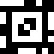
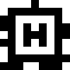
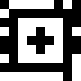
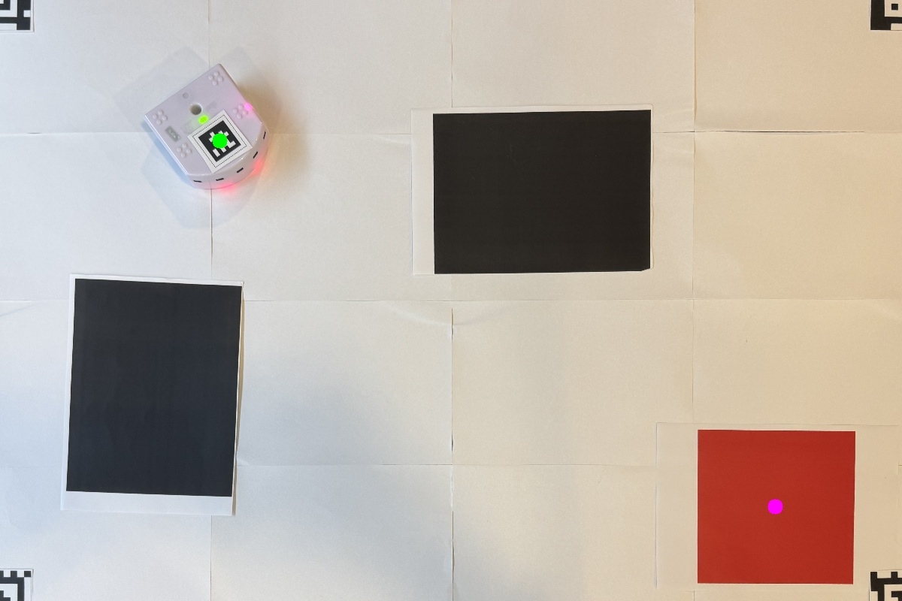
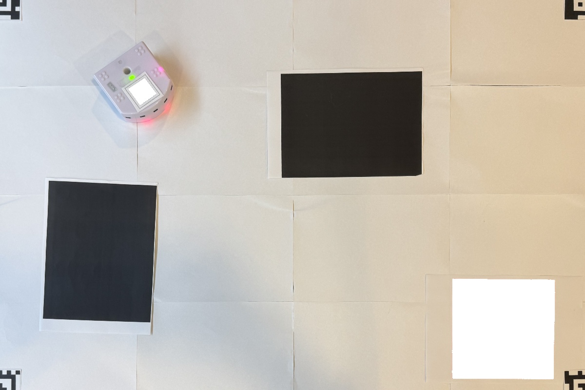
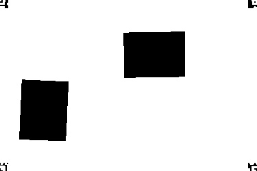
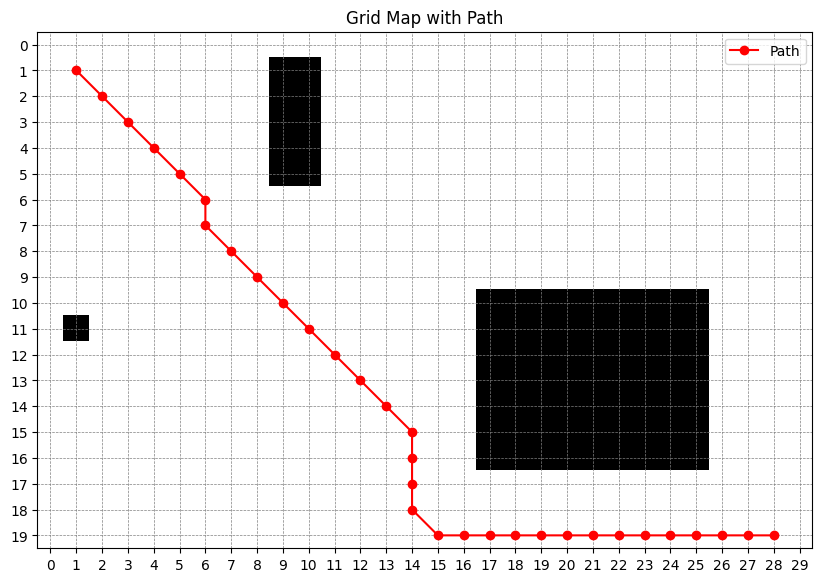
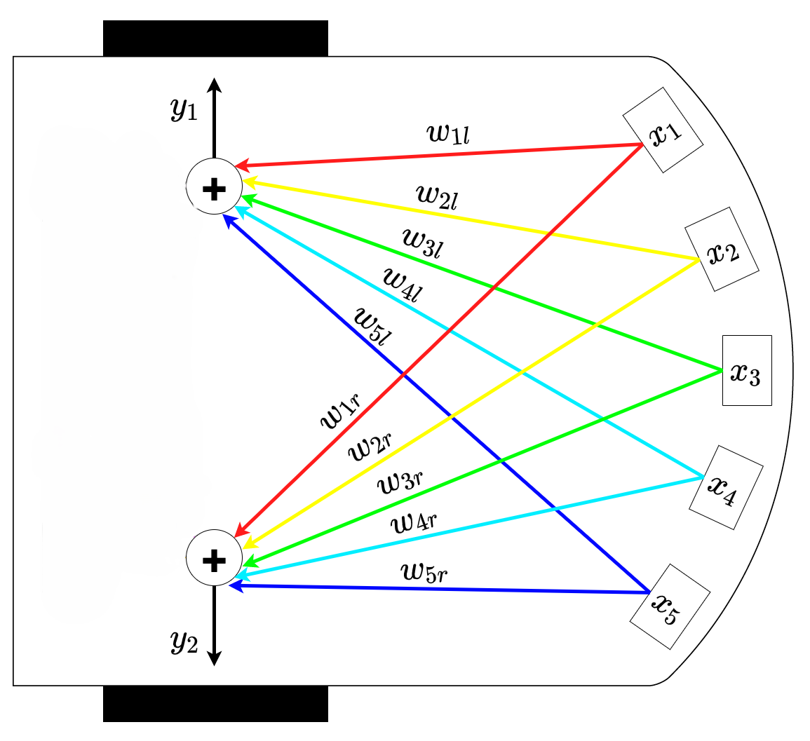
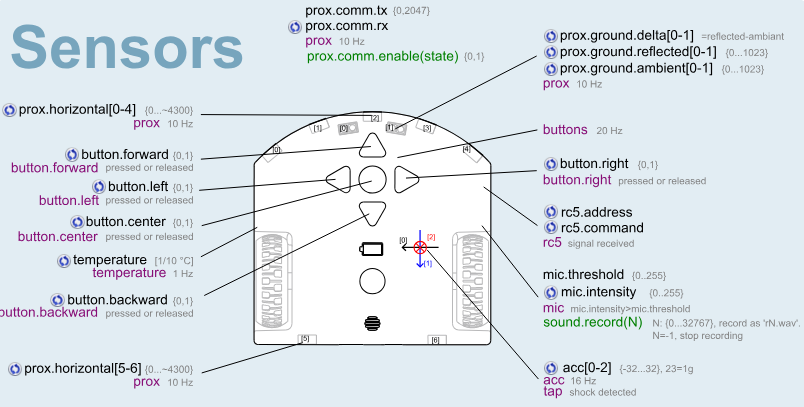
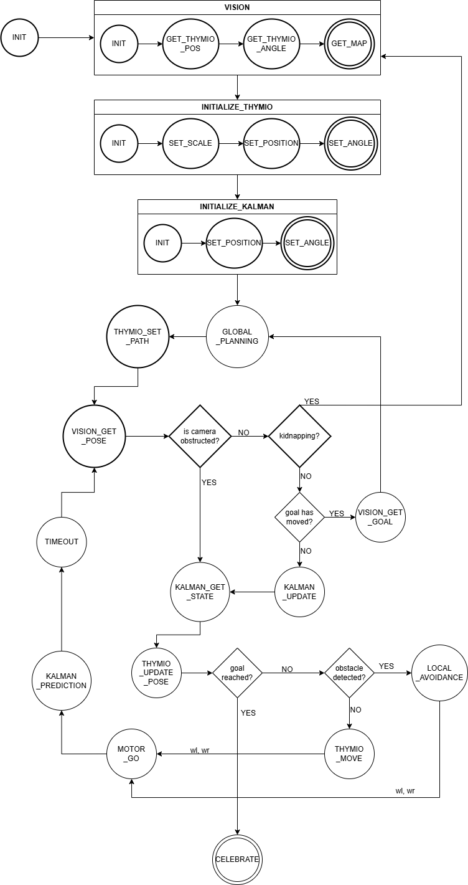

# EPFL-MICRO452 - Mobile Robotics Project
Project for the Mobile Robotic course, fall semester 2024

## Group Members
**Rocca Federico** (390233) - First year MSc in Robotics at EPFL, previous degree BSc in Computer Engineering at Politecnico di Milano  
**Rashidi Mohammad Massi** (394309) - First year MSc in CyberSecurity at EPFL previous degree BSc in Computer Science at University of Geneva       
**Rawas Mouhamad Bilal** (345489) - First year MSc in Robotics at EPFL, previous degree BSc in Microengineering at EPFL    
**Schär Mikaël Joël Michel** (325388) - First year MSc in Robotics at EPFL, previous degree BSc in Microengineering at EPFL

## Introduction
The aim of the project is to build a system able of controlling a <a href="https://www.thymio.org/" target="_blank">Thymio</a> robot. This system shoud integrate all the main modules that are tipically found in a simple mobile robot:
- **Vision**
- **Global Navigation**
- **Local Navigation**
- **Filtering**

The robot should will be placed in an **environment** (explained later) where there are some **permanent obstacles**. Given a **camera view** of the environment, a **global plan** should be generated, starting from the Thymio's position, leading to the goal and avoiding the permanent obstacles. Some **random obstacles** may be introduced in the environment during the movement of the robot from start to goal, and it should be able to avoid them. The robot should be localized both using the camera image, that can be obstructed on purpose from time to time, and the odometry, by fusing them with the **filtering**.

### Demo
Here's a demo of the system working:  

  <video width="640" height="480" controls>
    <source src="images/video.mp4" type="video/mp4">
  </video>

### Environment
The environment that the robot has to navigate has been designed by us, and it consists of a **white floor**, the traversable space, where we placed some **black cutouts**, that represent permanent obstacles, while the goal position is indicated by a **red mark** placed on the floor.  

    

In order to detect the white Thymio robot in the white background we decided to place an <a href="https://april.eecs.umich.edu/software/apriltag" target="_blank">AprilTag</a> on its top. It is used both for detecting the robot's position and orientation.
We also attached 4 AprilTags on the 4 corners of the environment in order to straighten the image that the camera records and generate precise measurements based on that image. The Apriltag's method is inspired by this <a href="https://github.com/adrienohana/thymioproject/blob/main/computer_vision.py" target="_blank">other project</a>.
<!-- Tag du robot -->

    Tag corresponding to the robot
    

<!-- Tags des 4 coins -->

    Tags corresponding to the 4 corners of the image
    
    
    
    

# Explanation of Implemented Modules
The next sections will explain how each module is implemented and how it works.

## **Vision**

The Vision system, implemented in the <code>Vision</code> class in <code>vision.py</code> detects the 4 corners of the map using **AprilTags** to align and straighten the image, identifies the robot’s position and orientation with a specific tag, locates the goal by detecting red zones, and generates a matrix that represents the map by highlighting obstacles, which correspond to the black areas on the map, and the accessible areas available for the Thymio robot to navigate. The system calculates and returns the map scale in pixels per millimiters for converting positions on the grid map to real world measurements.

<h2 align="center">Demo of Vision System</h2>

<!-- Step 1: Original Image -->

    <strong>1. Original Image Captured</strong> 
    

<!-- Step 2: Cropped Image -->

    <strong>2. Cropped and Aligned Image</strong> 
    

<!-- Step 3: Image with Start and Goal Highlighted -->

    <strong>3. Image with the center of the Start and the Goal Highlighted</strong> 
    

<!-- Step 4: Image with Red Regions and Tags Whitened -->

    <strong>4. Image with Red Regions and Robot's Tags Whitened</strong> 
    

<!-- Step 5: Final Map with Obstacles Highlighted -->

    <strong>5. Final Binary Map Showing Obstacles</strong> 
    

## **Global Planning**
The goal of this project is guide the robot from a start position to a goal position. To make this happen, it is necessary to implement a **global navigation** module, implemented in the <code>GlobalPlanning</code> class in <code>globalPlanning.py</code>. It works by building a path that our Thymio will follow, from the position of the robot to the position of our goal placed on our environment.

### **Dijkstra's Algorithm**
This algorithm is implemented on a grid representation of the map. Most of the code has been taken from the serie 5 of the course. In this grid it will search the most efficient path to reach our goal. Here an exemple of a grid taken from exercice session 5:  

    <strong>Grid with the start "S" and the goal "G"</strong> 
    

The first step is to assign a cost to all the cell of the map. To do this at each step from the start, we take all the neighbors not already evaluated and assign each one of them the cost of the current cell incremented by one. An exemple is provide for better understanding:

    <strong>Grid with the first iterations of the algorithm</strong> 
    

The second step is to find the less costly path. To find it, we take our grid and start from the goal. We take all the neighbors and select the cell with the smallest number as part of the path. Then we select the last cell added to the path, find the neighbor with lowest cost and add it to the path, repeating these steps untill we reach the start position. After that we can return the path by reversing the sequence of cells we built. Here an exemple of the shortest path between start and goal:

    <strong>Grid with the most optimized path in gray</strong> 
    

In our code the algorithm is implemented with the 8-connected grid, so we also consider as neighbors the cells on the diagonal direction. We can see the difference between 4-connectivity and 8-connectivity in the example here below:

    <strong>4 and 8-connected grid</strong> 
    
    

### **Shadows and magnification**

Before we call the Dijkstra's algorithm, we need to do somes adjustments on the map to be sure that the Thymio will find a path and won't drive on the obstacles. First step, we remove the "obstacles" around the thymio that could have been created by its own shadow or by its wheels. Second step, we proceed to enlarge the obstacles to avoid the path to come too close to the, and the robot to drive over an obstacle due to its width. Here you can see a result of the map before and after the magnification:

    <strong>Map before and after magnification</strong> 
    
    

## **Local Planning**
Once the global navigation module has designed a path from the start position to the goal, the local planning module has to generate the movement commands for the robot in such a way that it will follow that path, all while avoiding unexpected obstacles that might be detected while moving from the start position to the goal.

### **Motion Control**
The motion control, that is the process of generating motion commands to get the robot to follow the path generated by the global plannign module, is implemented in the <code>ThymioControl</code> class in <code>thymioControl.py</code>.

#### **Path Reduction**
As a first step, it reduces the path to the minumum sequence of waypoints. This means that all the points in the path that lay on the same straight line, excluding the first and last, are removed. Here is shown an example of this behavior:  

  
  

#### **Kidnapping Detection**
This module is also used for recognizing kidnapping situations. This means that when a new measurement of position and angle is received from the camera, it is compared with the prediction of position and angle produced by the Kalman filter at the previous step, and if the position or the angle differ by more than the relative thresholds <code>self.__kidnappingThresholdPosition</code> and <code>self.__kidnappingThresholdAngle</code>, a kidnapping situation is signaled and the kidnapping routine, explained later, is run.

#### **Movement Generation**
Given the current position and angle of the Thymio and the position of the next waypoint in the path that needs to be reached, the required velocity commands are calculated in this module. Two different approaches are present in the file: <code>move_pd(position, angle)</code> or <code>move(position, angle)</code>
- <code>move_pd</code>: the linear speed is considered always constant, while the angular speed is calculated using a PD controller, based on the angle difference between the Thymio orientation and the relative angle of the waypoint in respect to the robot for the proportional part and on the previous angle difference for the derivative part. The linear and angular speed are then used to compute the left and right motor speeds using differential drive kinematics.  
  PD controller: $$w = k_p \cdot \text{angleDistance} + k_d \cdot \frac{\text{angleDistance} - \text{previousAngleDistance}}{dt}$$
  with $k_p$ and $k_d$ respectively the proportional and derivative gain.
- <code>move</code>: this time, when an angle difference is detected between the Thymio's orientation and the direction throwards the waypoint, the robot is stopped (linear speed = 0), and it is rotated on the spot. The angular velocity used for turning is once again calculated using a PD controller. If instead the angle difference is less then the threshold <code>self.__angleThreshold</code>, the angular velocity is set to 0 and the linear velocity is set to a predetermined constant value, making the Thymio go straight throwards the waypoint.  

Both methods check if the current waypoint has been reached, by computing the distance from the robot to the waypoint and checking if it is less than the threshold <code>self.__reachedThreshold</code>, and if the waypoint has been overshot, maybe during a phase of obstacle avoidance, by comparing the distances between the robot and the next waypoint and betweent the current waypoint and the next wayopint; in both cases it would move onto the next waypoint.  

While the first method never stops the robot, so it is potentially faster and smoother, tuning the parameters $k_p$ and $k_d$ wrongly may lead to overshoots or oscillations. On the other hand, the stop-rotate-go controller is more precise but obviously slower, since the robot has to stop before turning on the spot.

### **Local Avoidance**
An important part in robot's navigation is the avoidance of unexpected obstacles that might be detected while moving from the start position to the goal, following the global plan. The process of local avoidance consists of detecting the obstacles using the robots sensors and designing a more or less efficient plan to get around it, avoiding collisions, and get back on the predetermined global plan.
The python file <code>localPlanning.py</code> contains the <code>LocalPlanning</code> class that implements the local avoidance modules.

#### **Obstacle Detection**
When the <code>self.is_obstacle_avoidance(prox_horizontal)</code> method is called, a boolean value is returned, <code>True</code> if any of the sensors is reading higher than the threshold, <code>False</code> otherwise.

#### **Obstacle Avoidance**
If an obstacle is detected, the obstacle avoidance routine <code>self.obstacle_avoidance(prox_horizontal)</code> generates directly the motor commands **wl** and **wr** by multiplying the values recorded by the proximity sensors by two symmetric arrays of weights, one for each motor, virtually generating a push, away from the obstacle. This implements a really simple neural network, with one neuron for each motor, that takes the sensor values as inputs and computes the motor command. This approach is inspired by what was proposed in exercise session 3.

    <strong>Neural Network used for Obstacle Avoidance</strong> 
    

## **Kalman Filter**

The Kalman Filter is a mathematical tool used in this project to estimate the robot's position and orientation (state) while navigating toward a goal. The robot uses data from two sources: **odometry** (wheel speeds) for prediction and a **camera** for occasional updates. Since both these sources are noisy and prone to errors, the Kalman Filter combines their information to produce an accurate and smooth estimate of the robot’s state. It is implemented in the <code>Kalman</code> class in <code>kalman.py</code>.

#### **Nonlinear Motion Model**

A differential-drive robot's motion is inherently nonlinear because its position $(x, y)$ and orientation $\theta$ depend on trigonometric relationships. For example, its state evolves as (motion model):

$$
x_{t+1} = x_t + v \cos(\theta) \Delta t, \quad y_{t+1} = y_t + v \sin(\theta) \Delta t, \quad \theta_{t+1} = \theta_t + \omega \Delta t
$$

Here:
- $v$: Linear velocity (derived from wheel speeds).
- $\omega$: Angular velocity (based on differential wheel motion).
- $\Delta t$: Time step.

The EKF linearizes these equations using the Jacobian of the motion model. In the **Kalman class**, the motion model is embedded in the matrix $\mathbf{G}$

#### **Fusing Odometry and Camera Data**

Odometry (wheel encoder data) is prone to errors such as:

- **Drift** over time, accumulating inaccuracies as the robot moves.
- **Wheel slippage** and uneven terrain causing deviations from the true trajectory.

The camera, while more accurate, provides intermittent data due to potential obstructions or missed detections. The EKF combines these two sources of data to provide a reliable state estimate:

1. **Prediction Step**: This step uses the odometry data to predict the robot's next state. It always runs, regardless of whether camera data is available, ensuring continuity in state estimation. The prediction compensates for missing measurements and accounts for process noise.

2. **Update Step**: This step completes the prediction using camera measurements when available. It refines the estimated state by fusing the relatively accurate camera data with the prediction. The update step only runs if the camera is not obstructed.

#### **How the Kalman Filter Works**

**A. Prediction Step**

Using the robot's last known state, wheel speeds, and time elapsed (Δt), the Kalman Filter predicts the robot's next state:

$$
\mathbf{E}_{\text{pred}} = \mathbf{A} \cdot \mathbf{E} + \mathbf{G} \cdot \mathbf{U}
$$

- **A**: State transition matrix (accounts for constant movement without changes).
- **B**: Control matrix (maps wheel speeds to motion).
- **U**: Control vector (wheel speeds).

It also predicts the **uncertainty** in the state, denoted by the covariance matrix **P**:

$$
\mathbf{P}_{\text{pred}} = \mathbf{A} \cdot \mathbf{P} \cdot \mathbf{A}^T + \mathbf{R}
$$

- **Q**: Process noise covariance (uncertainty from wheel encoders).

**B. Update Step**

When the camera provides a measurement **Z**, the Kalman Filter updates the state and uncertainty:

1. Compute the Kalman gain **K**, which determines how much weight to give to the measurement:

$$
\mathbf{K} = \mathbf{P}_{\text{pred}} \cdot \mathbf{H}^T \cdot \left(\mathbf{H} \cdot \mathbf{P}_{\text{pred}} \cdot \mathbf{H}^T + \mathbf{Q}\right)^{-1}
$$

- **H**: Measurement matrix (maps state to camera readings).
- **R**: Measurement noise covariance (uncertainty in camera data).

2. Update the state using the measurement:

$$
\mathbf{E}_{\text{update}} = \mathbf{E}_{\text{pred}} + \mathbf{K} \cdot \left(\mathbf{Z} - \mathbf{H} \cdot \mathbf{E}_{\text{pred}}\right)
$$

3. Update the uncertainty:

$$
\mathbf{P}_{\text{update}} = (\mathbf{I} - \mathbf{K} \cdot \mathbf{H}) \cdot \mathbf{P}_{\text{pred}}
$$

### **Behavior in the Control Loop**

1. **Prediction Always Happens**:
    * The prediction step runs at every iteration using odometry.
    * This ensures the robot always has an estimated position, even if the camera data is unavailable.

2. **Update Happens When the Camera Sees the Robot**:
    * If the camera detects the robot, the Kalman Filter corrects its prediction using the more accurate camera measurement.

3. **Handling Obstructions**:
    * If the camera is obstructed, the filter relies solely on the prediction step until the camera resumes detection.

# Tuning of Parameters
The following section explains how the various parameters used throughout the project where selected and tuned.

#### **Obstacle Avoidance**
- **Obstacle Detection Threshold**: the Thymio robot features 5 horizontal **proximity sensors** it its front part (see Thyimio cheat sheet snippet) that can be used to detect obstacles using infrared technology. The range of values that the sensors return is [0, ~4300] and the updates come at a frequency of 10Hz.
    

        
    

    It is possible to map the readings from the proximity sensors to the real world distance measurements in order to tune the threshold for activating the local avoidance routine. In order to do so, many measurements were taken with an obstacle at a known distance and the average of the values was computed:  

    | Distance | Sensor Reading (average value) |
    | --- | ---: |
    | 5 | 4300 |
    | 10 | 3095 |
    | 15 | 2350 |
    | 20 | 1690 |

    We chose the vector <code>[2500, 2400, 2300, 2400, 2500]</code> for the thresholds relative to each front sensor, meaning a distance of a little bit more of 15 cm. Detection close to the ceter has a lower threshold with respect to an obstacle on the side because it is necessary to start avoiding before if the obstacle is located straight in frony of the robot.

- **Weights for the ANN in Obstacle Avoidance**: as said before, obstacle avoidance is implemented by passing the proximity sensors' readings through a simple NN. The vector of values is multiplied by a vector of weights, one for each motor, in order to determine the wheel commands necessary for avoiding the obstacle. The weights have been chosen by trial and error, in order to generate a strong enough push away from the obstacle without disrupting too much the trajectory.

#### **Thymio Control**
- **Conversion ratio from Thymio wheel commands (PWM) to mm/s**:  
   This was calculated by measuring the distance covered over time using ground sensor peaks, by driving the Thymio over evenly spaced stripes, as done during execise session 4. The Thymio's speed in mm/s was divided by the corresponding PWM value to determine the conversion ratio.  

- **Motor speed adjustment scalar**:  
   A scalar adjustment was applied to one motor’s PWM to correct for a speed imbalance between the left and right motors. This value was determined empirically through testing to ensure straight-line movement.  

- **Proportional and derivative gains**
   They are used to select the next motor commands based on the angle difference between the Thymio orientation and the direction throwards the next waypoint. The proportional gain $k_p$ has been selected in such a way that it would guarantee fast enough rotations while avoiding overshooting and oscillations, while the derivative gain $k_d$ has been tuned to reduce oscillations.

#### **Kalman Filter**
- **Variance of speed in mm²/s²**:  
   The speed variance was computed as the variance of the recorded speed data (in mm/s) after converting using the conversion ratio and excluding initial transients. The variance was split equally between the **speed state** variance and the **speed measurement** variance, each being half of the total variance. This is again inspired by the approach in exercise session 4.  

#### **Global Planning**
- **Magnification for obstacles**:
   When computing the global plan the obstacles need to be enlarged so that the path does not pass too close to the obstacles. This would be a problem because the position of the Thymio is determined by the center point of the tag on its top, so if the robot was to follow a path really close to an obstacle, its wheel would be inside the obstacle.
   The magnification parameter has been tuned to 1 time the distance between the Thymio wheels and then it is converted in number of cells.

#### **Vision**
- **Color Threshold**
   We hand-tuned the threshold used for discriminating obstacles, so black pixels, from backgroung, so white/grayish pixels, in the image recorded by the camera. This threshold might need to be adjusted based on light conditions.

   - **Parameters**

1. **Conversion ratio from Thymio speed (PWM) to mm/s**:  
   This was calculated by measuring the distance covered over time using ground sensor peaks. The Thymio's speed in mm/s was divided by the corresponding PWM value to determine the conversion ratio.

2. **Variance of speed in mm²/s²**:  
   The speed variance was computed as the variance of the recorded speed data (in mm/s) after converting using the conversion ratio and excluding initial transients. The variance was split equally between the **speed state** variance and the **speed measurement** variance, each being half of the total variance.   

3. **Motor speed adjustment scalar**:  
   A scalar adjustment was applied to one motor’s PWM to correct for a speed imbalance between the left and right motors. This value was determined empirically through testing to ensure straight-line movement.

4. **Magnification**:
   The value is calculated with the Thymio size and convert in cell's format. It is used to remove the shadow around the robot and to enlarge the obstacles in the map.

# Code
## Imports
First step, all the classes that have been explained above need to be imported.
In order to be sure that all the python packages are correctly installed and ready to use, it is suggested to run <code>pip install -r requirements.txt</code> to get all of them. It should be noted that the <code>pupil-apriltags</code> package may give some problems with python versions higer than 3.10.

We also need to install the <code>tdmclient</code> package, used for connecting and comunicating with the Thymio. The control from the notebook is made possible by the import of <code>tdmclient.notebook</code>.  

# Control Loop
The next code section presents the main control loop that unites all the modules and functionalities. It is implemented following the finite state machine here below:

    

As seen in the FSM above, the first steps that need to be taken are the initalizations of the various classes, like getting the first image from the vision, localizing the Thymio, generating the global plan and initializing the first position in the Kalman filter.
After that, the main loop can start. The loop runs untill the goal is reached and it consists in the next steps:
1. getting the observation from the vision
2. if the observation is not null, updating the Kalman position (*)
3. if the sensors are detecting an obstacle, run the obstacle avoidance routine
4. otherwhise, if no obstacle is detected, based on the position from the Kalman and the next waypoint, generate the movement commands
5. predict the future position based on the motor commands, using the Kalman prediction

(*) if the camera returns a non-null position, it is also required to check for kidnapping before the Kalman update